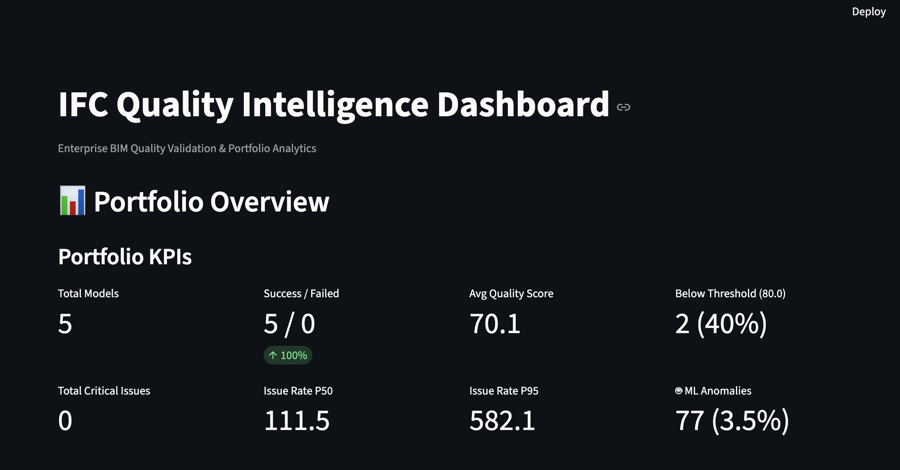
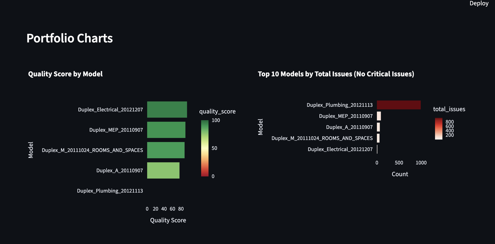
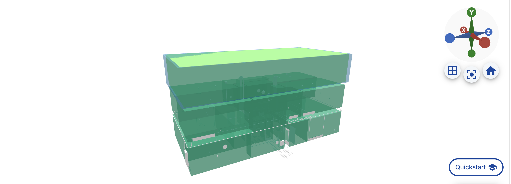

# IFC Quality Intelligence Platform


> Enterprise-grade BIM Quality Validation with ML-powered Anomaly Detection and Portfolio Analytics

## 🎯 Overview

The **IFC Quality Intelligence Platform** automatically validates IFC building models at scale, combining rule-based checks with machine learning to detect quality issues across hundreds of models.

**Perfect for:**
- Multi-contributor BIM projects (600+ models)
- Quality gates in BIM execution plans
- Continuous validation in CI/CD pipelines
- Portfolio-wide quality monitoring

---

## ✨ Key Features

✅ **Rule-Based Validation** - 7 quality checks (missing metadata, geometry issues)
✅ **ML Anomaly Detection** - Isolation Forest for geometric outliers
✅ **Batch Processing** - Process entire directories with fault tolerance
✅ **Portfolio Analytics** - Aggregate metrics across 100s of models
✅ **Dual Dashboards** - Single model + Portfolio overview modes
✅ **88 Passing Tests** - Production-ready code quality

---

## 🚀 Quick Start

### 1. Installation

```bash
git clone https://github.com/dheerajram13/ifc-quality-intelligence.git
cd ifc-quality-intelligence

python -m venv venv
source venv/bin/activate  # Windows: venv\Scripts\activate

pip install -r requirements.txt
pip install -e .
```

### 2. Single File Analysis

```bash
# Analyze one IFC file with ML
python examples/example_ml_anomaly_detection.py examples/ifc_files/Duplex_MEP_20110907.ifc

# Output:
# ✓ Quality Score: 90.6/100
# ✓ Issues: 90 (1 major, 89 minor)
# ✓ ML Anomalies: 49 (5.1%)
```

### 3. Batch Processing (Portfolio Mode)

```bash
# Process all IFC files in a directory
python examples/example_batch_processing.py examples/ifc_files

# Creates:
# output/portfolio/
#   ├── portfolio_summary.csv      # One row per model
#   ├── portfolio_metrics.json     # Aggregate KPIs
#   └── <model_name>/
#       ├── metrics.json
#       ├── issues.csv
#       ├── anomalies.csv
#       └── report.html
```

### 4. Launch Dashboard

```bash
# Portfolio Dashboard (NEW!)
streamlit run apps/portfolio_dashboard.py

# Access at http://localhost:8501
```

---

## 📊 Portfolio Dashboard

### Two Modes

**1. Portfolio Mode** - Overview of 100+ models
- Portfolio KPIs (avg quality, models below threshold, total issues)
- Quality score distribution
- Top 10 offenders by critical issues
- Pareto analysis across all models
- **Drilldown** - Click model → view detailed charts



**2. Single Model Mode** - Deep dive on one model
- Quality threshold slider (PASS/FAIL)
- Severity breakdown
- Top 20 issues table (actionable)
- Metadata completeness metrics

### Key Dashboard Features

**Portfolio Charts:**



---

## 📖 Usage Guide

### Scenario 1: Daily Quality Check (Project Manager)

```bash
# 1. Process latest models
python examples/example_batch_processing.py /path/to/models

# 2. Open dashboard
streamlit run apps/portfolio_dashboard.py

# 3. Review in 2 minutes:
#    - Success rate (all processed?)
#    - Avg quality (trending up?)
#    - Models below threshold
#    - Click worst model → see specific issues
```

### Scenario 2: Model Acceptance (BIM Coordinator)

```bash
# 1. Launch dashboard
streamlit run apps/portfolio_dashboard.py

# 2. Switch to "Single Model" mode

# 3. Upload IFC file or use output folder

# 4. Check quality threshold status:
#    ✅ PASS (Score: 92.3) → Accept
#    ❌ FAIL (Score: 67.1) → Review top issues table → Reject
```

### Scenario 3: Batch Validation (600 models)

```bash
# Sequential (slow for 600 models)
python examples/example_batch_processing.py /models

# Parallel (4x faster - recommended)
# Edit example_batch_processing.py:
# max_workers=8

python examples/example_batch_processing.py /models

# Outputs:
# - Portfolio summary CSV (one row per model)
# - Portfolio metrics JSON (aggregate KPIs)
# - Per-model detailed reports
```

---

## 🏗️ Architecture

```
IFC File(s) → Batch Processor → Per-Model Pipeline:
                                   ├─ IFC Loader
                                   ├─ Geometry Features
                                   ├─ Quality Checks (7 rules)
                                   ├─ ML Anomalies
                                   └─ Metrics

              Portfolio Aggregator → Portfolio KPIs

              Dashboard (Streamlit) → [Portfolio | Single Model]
```

---

## 📊 Quality Metrics

### Quality Score Formula

```python
score = 100 - (weighted_issues / total_elements × 100)

# Weights:
# critical = 3.0
# major = 2.0
# minor = 1.0
```

### 7 Quality Checks

| Check | Severity | Example |
|-------|----------|---------|
| Missing Name | Major | Element without name attribute |
| Missing ObjectType | Minor | Missing type metadata |
| Duplicate GlobalId | Critical | Same ID used twice |
| Degenerate Geometry | Major | Dimension < 1mm |
| Extreme Dimensions | Critical | Dimension > 100km |
| Coordinate Anomalies | Minor | Element far from origin |
| Extreme Aspect Ratios | Minor | Very thin/flat shapes (ratio > 1000) |

### ML Anomaly Detection

- **Algorithm:** Isolation Forest (unsupervised)
- **Features:** 9 geometric properties (dims, centroids, aspect ratios)
- **Contamination:** 0.05 (expect 5% anomalies)
- **Output:** Anomaly score + probability (0-1)

---

## 📁 Project Structure

```
ifc-quality-intelligence/
├── src/ifcqi/
│   ├── ifc_loader.py         # IFC parsing
│   ├── geometry.py           # 3D geometry extraction
│   ├── features.py           # Feature engineering
│   ├── checks.py             # 7 quality rules
│   ├── metrics.py            # Scoring & KPIs
│   ├── batch.py              # Portfolio processing
│   ├── viz.py                # Plotly charts
│   └── ml/
│       ├── preprocessing.py  # Feature scaling
│       └── anomaly_detection.py  # Isolation Forest
│
├── apps/
│   ├── dashboard.py           # Single model (legacy)
│   └── portfolio_dashboard.py # Portfolio + Single (NEW!)
│
├── examples/
│   ├── example_quality_checks.py
│   ├── example_ml_anomaly_detection.py
│   └── example_batch_processing.py
│
├── tests/                     # 88 tests
│   ├── test_ifc_loader.py    (20 tests)
│   ├── test_checks.py        (25 tests)
│   ├── test_metrics.py       (6 tests)
│   ├── test_viz.py           (12 tests)
│   └── test_ml.py            (25 tests)
│
└── output/
    └── portfolio/
        ├── portfolio_summary.csv
        ├── portfolio_metrics.json
        └── <model_name>/...
```

---

## 🧪 Testing

```bash
# Run all 88 tests
pytest

# Run specific module
pytest tests/test_ml.py -v

# With coverage
pytest --cov=ifcqi --cov-report=html

# Current status: ✅ 88/88 passing
```

---

## 🎯 Example Results

### Single Model: Duplex_MEP_20110907.ifc

```
Elements:        973
Quality Score:   90.6/100 ✅
Issues:          90 (0 critical, 1 major, 89 minor)
ML Anomalies:    49 (5.1%)

Top Issues:
  - 47 missing object_type
  - 42 extreme aspect ratios
  - 1 missing name

ML detected:
  - 25 IfcFlowSegment (unusual pipe dimensions)
  - 24 IfcSpace (57% of rooms - irregular shapes)
```

### Portfolio: 5 Models

```
Total Models:    5
Success:         5 (100%)
Avg Quality:     70.1/100
Below Threshold: 2 (40%)

Total Issues:    1,211
  Critical: 0
  Major:    975
  Minor:    236

ML Anomalies:    122 (4.5% avg rate)

Worst Model:  Duplex_Plumbing_20121113 (score: 0.0)
Best Model:   Duplex_Electrical_20121207 (score: 94.5)
```

**Dataset Visualization:**



---

## ⚙️ Configuration

### Quality Threshold

```python
# In portfolio_dashboard.py sidebar:
quality_threshold = 80.0  # Models below = FAIL

# Adjust based on project requirements:
# 90+ = Excellent
# 80-89 = Good
# 70-79 = Acceptable
# <70 = Needs work
```

### Parallel Processing

```python
# In example_batch_processing.py:
max_workers = None  # Sequential (safe, slow)
max_workers = 4     # Parallel (4x faster)
max_workers = 8     # Max CPU cores
```

### Enable/Disable ML

```python
# Batch processing:
enable_ml = True   # ML anomaly detection ON
enable_ml = False  # Skip ML (faster)
```

---

## 🚀 Performance

### Processing Time (Per Model)

```
Duplex_MEP_20110907.ifc (973 elements):
  - IFC Loading:      0.5s
  - Geometry:         1.5s
  - Quality Checks:   0.3s
  - ML Anomalies:     2.5s
  - Total:           ~5s

Scaling to 600 models:
  Sequential:  ~50 minutes
  Parallel (8): ~7 minutes
```

---

## 📞 Support

**Questions?**
- Check `output/portfolio/portfolio_summary.csv` for failed models
- Review examples/ folder for usage patterns
- Run `pytest` to verify installation

**Author:** Dheeraj Srirama
**Portfolio:** [dheerajsrirama.netlify.app](https://dheerajsrirama.netlify.app)
**GitHub:** [@dheerajram13](https://github.com/dheerajram13)

---

## 📝 License

MIT License - See LICENSE file for details

---

**Built for enterprise-scale BIM quality validation**

*Demonstrates production ML engineering: feature extraction, validation pipelines, batch processing, portfolio analytics, and interactive dashboards for real-world AEC data.*
